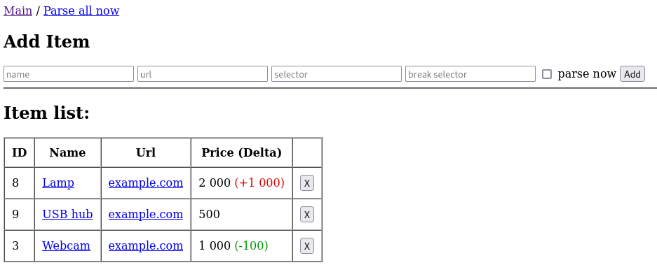
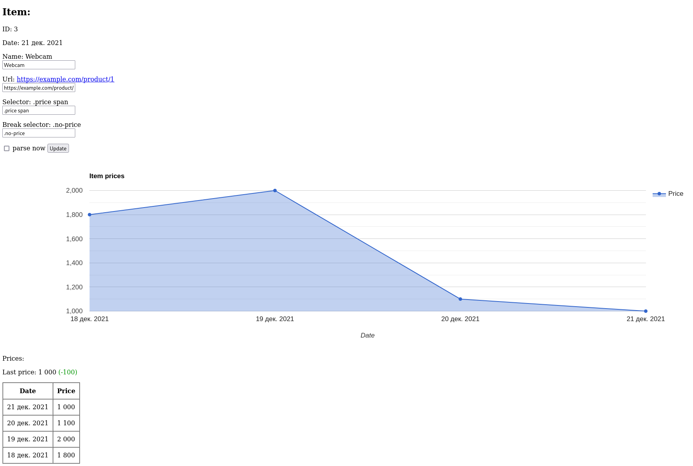

# Price tracker
Track prices from websites. 

### Opportunities:

* Web interface.
* Keeping a history of price changes.
* Displaying price changes on the chart.
* Automatic start of the collector at night.
* Manual start of the collector.
* Launch in service mode.

## Screenshots

### Main page:


### Detail view:


Installation
------------

```bash
$ git clone https://github.com/chiefss/price-tracker
$ cd price-tracker
$ ./gradlew bootJar
```
Jar file will be created in the directory build/libs.


Configuration
------------
Create a file application-custom.properties in the same directory as the price-tracker-0.0.1-SNAPSHOT.jar 

#### Port:
```bash
server.port=8080
```

#### Database path:
```bash
spring.datasource.url=jdbc:h2:file:./price-tracker
```

#### Enable email reports:
```bash
app.mail.enabled=true
```

#### Email for reports:
```bash
app.mail.admin=no-reply@example.com
```

#### SMTP settings:
```bash
app.mail.from=me@example.com
app.mail.host=example.com
app.mail.username=me
app.mail.password=password
```


Simply run:
------------

```bash
$ java -jar ./build/libs/price-tracker-0.0.1-SNAPSHOT.jar
```

Run web browser http://localhost:8080


Run as service (systemd)
------------
Create service:
```bash
$ sudo vim /etc/systemd/system/price-tracker.service
```

Replace EXAMPLE to correct username
```bash
[Unit]
Description=Price Tracker Java Service
[Service]
User=EXAMPLE
# The configuration file application.properties should be here:

#change this to your workspace
WorkingDirectory=/home/EXAMPLE/price-tracker

#path to executable. 
#executable is a bash script which calls jar file
ExecStart=java -jar /home/EXAMPLE/price-tracker/price-tracker-0.0.1-SNAPSHOT.jar

SuccessExitStatus=143
TimeoutStopSec=10
Restart=on-failure
RestartSec=5

[Install]
WantedBy=multi-user.target
```

Run web browser http://localhost:8080
